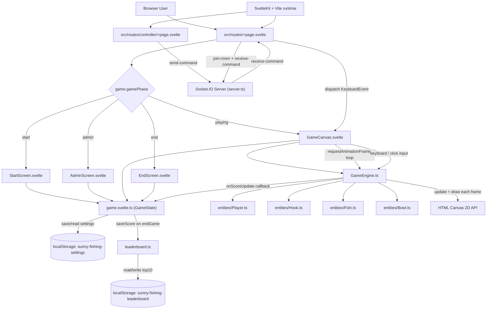

# 專案使用工具
- 使用 Svelte Kit框架
- 動畫使用 HTML原生 Canvas API
- 未使用資料庫，排行榜與計分寫在瀏覽器的 localstorage

# 基礎架構
- Svelte框架的基礎畫面與邏輯拆分
  - *.svelte：基礎畫面設計，與原生 HTML寫法相同，差別在於可使用 svelte獨有佔位符
  - *.ts：基礎邏輯設計，以 Type script撰寫
- 畫面拆分
  - AdminScreen.svelte：設定頁面
  - StartScreen.svelte：開始遊戲頁面(遊戲說明、排行榜)
  - GameCanvas.svelte：主要遊戲畫面
  - EndScreen.svelte：遊戲結算畫面(得分、排行榜)
- 組件拆分
  - Bowl.ts：接魚容器組件
  - Fish.ts：魚組件
  - Player.ts：玩家組件(晴天本人)
  - Hook.ts：魚鉤組件
  - GameEngin.ts：遊戲運行引擎，遊戲運行主要核心
  - game.svelte.ts：遊戲互動介面，連接 *.svelte與 *.ts的介面
  - leaderboard.ts：排行榜處理邏輯

# 架構圖

# 其他說明
- 遊戲圖片靜態資源放在 static目錄中
- 在專案根目錄中可使用 `npm run dev`指令啟動熱加載做開發測試，預設 port為 5173
- 進入遊戲後台密碼為 `jbj`

# 部屬方式
- 目前使用 vercel部屬專案
- 在 github上建立 repo，並使用 vercel免費額度連接 repo
